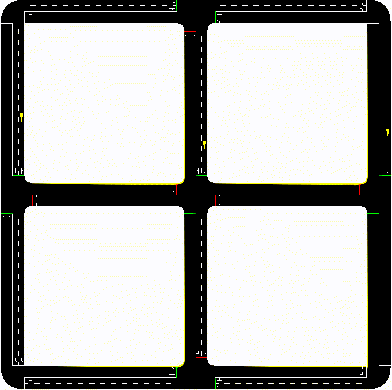
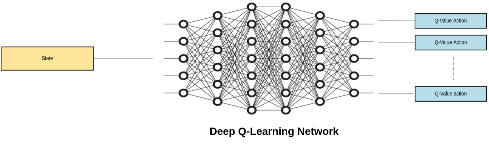

# DAI_ReinforcementLearning


This project implements a traffic light control simulation using SUMO (Simulation of Urban MObility) with a Reinforcment Learning approach in **M**ulti**A**gent **S**ystem.
<br>

<div style="text-align: center;"></div>


## Prerequisites

- Python 3.x
- SUMO (Simulation of Urban MObility)


## Project 


### Training
The core concept is illustrated in the figure below:


We are in a collaborative scenario where each agent observes the environment and makes decisions based on the following:
- Average Wait Time
- Queue length
- Outbound vehicle throughput

Based on its own observations, as well as those shared by other agents, each agent can take one of the following actions:
- Traffic based action 
- $Q$-Network-based action
- Random exploration ($\epsilon$-greedy) 

The reward function at time step $t$ is computed as:
$$Er_t = \Delta W_t - \lambda Q_t + \alpha \cdot throughput_t$$


Where: 
- $\Delta W_t$​: The reduction in average wait time ($W_{t−1}−W_t$​).
- $\lambda \cdot Q_t$ : A penalty term proportional to the total queue length at time $t$, with scaling factor $\lambda$.
- $\alpha \cdot throughput_t$: A reward term proportional to the throughput of outbound vehicles, with weighting factor $\alpha$.

This reward function is designed to balance efficiency (reducing wait times and increasing throughput) while penalizing high queue lengths.


## Usage

Training:
```bash
python src/main.py --env 2x2 [--nogui] [--steps <number_of_steps>]
```
Inference:
```bash
python src/compare.py --type [random,curriculum,wave] [--norl] [--nogui] [--plot]
```
